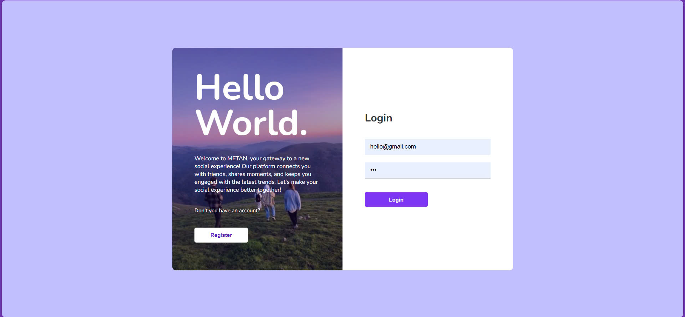
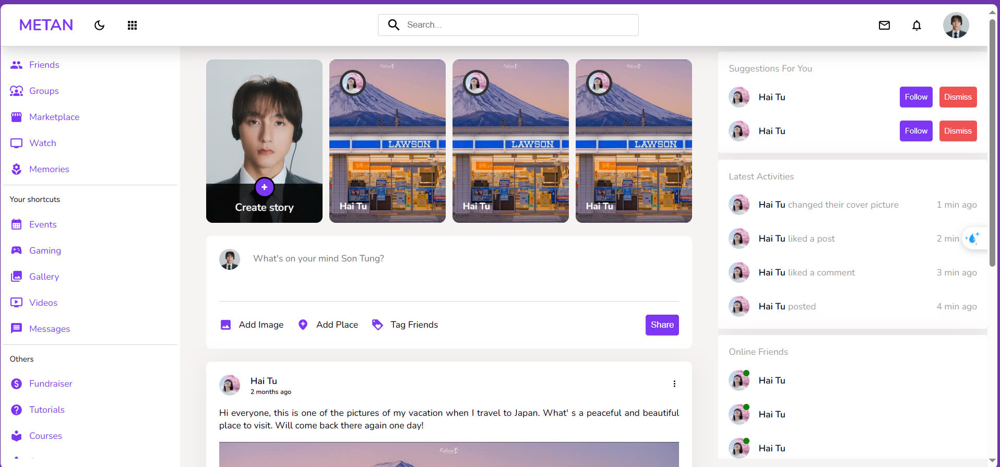
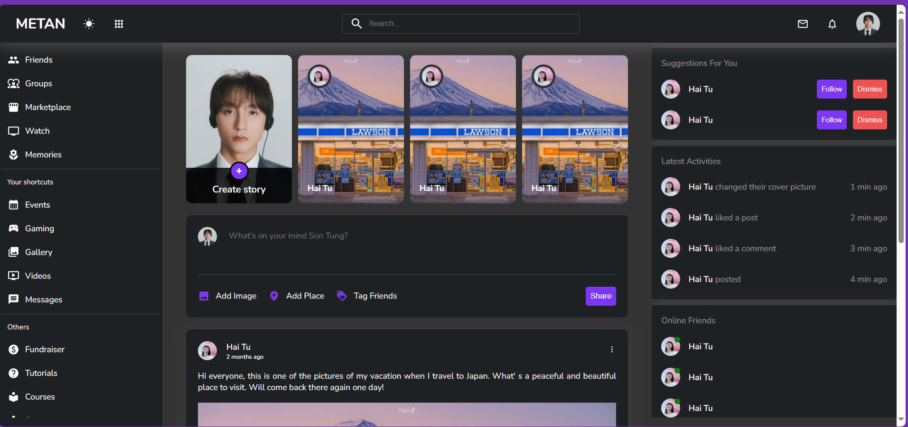
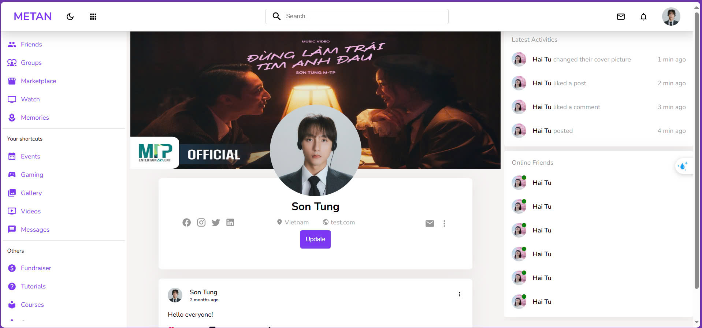
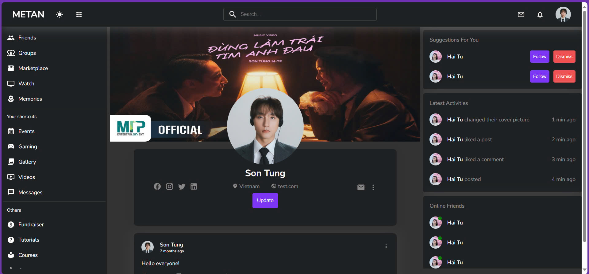

# 📷 METAN - Social Web Application

__METAN__ is a social web application inspired by Instagram, providing a platform for users to share photos, interact with posts, and connect with others. The application allows users to create posts, like, comment, and follow each other, enhancing the social experience.

## 🌟 Features
- **User Authentication:** Secure sign-up and login using JWT-based authentication.
- **Post Creation:** Users can create posts with captions and upload images.
- **Like & Comment:** Users can like posts and leave comments, fostering engagement.
- **Follow System::** Users can follow/unfollow each other to keep up with new posts.
- **User Profile::** Personalize user profiles with avatars and update personal information.
- **Feed Page:** Displays a feed of posts from users that the current user follows.

## 💻 Technologies Used
### ✔️ Front-end
- **ReactJS**: Front-end framework for building user interfaces.
- **React Router**: For managing navigation between pages.
- **@tanstack/react-query**: For managing server state and data fetching.
- **SCSS**: For styling the application.

### ✔️ Back-end
- **Node.js:** JavaScript runtime for building scalable server-side applications.
- **Express:** A web framework for Node.js for building APIs.
- **JWT (JSON Web Token):** For secure user authentication and session management.
- **MySQL:** A relational database for storing user, post, and interaction data, managed via MySQL Workbench.

## 🛠️ System Requirements

Before running the application, ensure you have the following installed:
- Node.js 20.17.0 __(Recommend)__
- MySQL installed.
- Git installed.
- MySQL Workbench for database management.

## 🚀 Getting Started
### ✔️ Backend Setup
1. Clone the backend repository:
    ```
    git clone https://github.com/Havold/social-web-backend.git
    cd social-web-backend
    ```

2. Install the dependencies:
    ```
    npm install
    ```

3. Set up your `.env` file with the following environment variables:
    ```
    PORT = 8080
    DATABASE_HOST = your_database_host_name
    DATABASE_PWD = your_database_password
    DATABASE = your_database_name
    ```

4. Run the backend server:
    ```
    npm start
    ```
⚠️ **Note:** These are just the basic settings. For more details on creating a database, please check out my BE project: https://github.com/Havold/social-web-backend
### ✔️ Frontend Setup
1. Clone the frontend repository:
2. Install dependencies:
   ```
   npm install
   ```
4. Run the frontend development server:
    ```
    npm start
    ```
## ⚡ Usage
1. Open your browser and navigate to:
    ```
    http://localhost:3000
    ```
2. Register a new account or login with an existing account.
3. Create a new post, like, and comment on other users' posts.
4. Follow other users to see their posts in your feed.

## 🖼️ Screenshots
__1. Login Page__


__2. Home Page (Light Mode)__


__3. Home Page (Dark Mode)__


__4. User Profile (Light Mode)__


__5. User Profile (Dark Mode)__


## ⚠️ Important Notice
- This project has only completed the basic functions mentioned above, functions such as stories, user suggestions will be developed in the future.
- This project needs a Back-end, I suggest you check out my BE project here: https://github.com/Havold/social-web-backend
----------------------------------------------------------------------------------------
